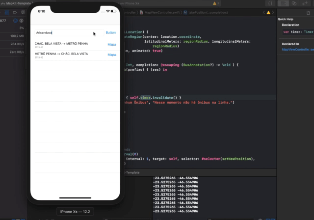

# MyBus

**MyBus** is a simple application for learn how to use MapKit and SPTrans API, use for search where stay your bus.

### Dependencies 

- [API SPTrans](http://www.sptrans.com.br/desenvolvedores/api-do-olho-vivo-guia-de-referencia/documentacao-api/#docApi-posicao)
- [MapKit](https://developer.apple.com/documentation/mapkit/mkmapview)

## Thank for watch!
